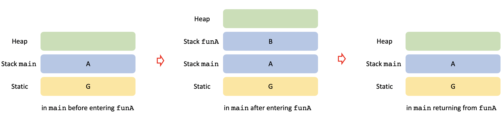
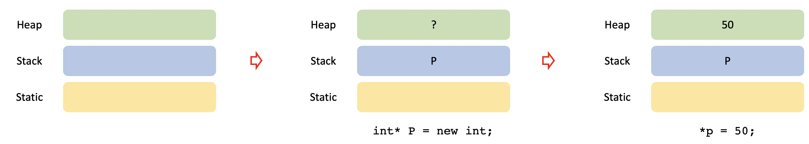

[Memory Allocation](#memory-allocation) - 
[Declaration, Definition](#declaration-definition) -
[Files structure](#files-structure) -
[Object Oriented Programming](#object-oriented-programming) -
[Pointer](#pointer) -
[Functions](#functions) -
[Class](#class) -
[Variable](#variable) -
[Casting](#casting) -
[Operator](#operator) -
[Array](#array) -
[multidimensional array](#multidimensional-array) -
[Passing to a function](#passing-to-a-function) -
[Loop](#loop) -
[String](#string) -
[Number](#number) -
[IO](#io) -
[Run a C++](#run-a-c) -
<!--  -->
<!--  -->
<!--  -->
# Memory Allocation

* **Scope**: where in a program a variable can be referenced.
* **Lifetime**: how long a variable exist in memory.
* **Local variables**: variables that are declared within a function or block of code. 
*Block of code* can be a loop, a condition, etc.  
Local variable's  *scope* is limited from the point of declaration to the end of the function or the block of code in which they are declared.  
Their *lifetime* is from entering a function or a block of code in which they are declared to termination of it.  
* **Global variables:** variables declared outside of any function.  
Global variable's *scope* is anywhere in the program.  
Their *lifetime* is the duration of the program.  

`{}` create block of code.

## Stack
`C++` uses the following memory allocation: 
* Heap (free store)
* Stack 
* Static (for global variables)

To understand how it works, let's assume the following code:

```c++
// declaration of global variables
int G

int main()
{
    // declaration of local variables
    int A = funA();
    return A;
}

int function funA()
{
    // declaration of local variables
    int B = 0;
    return B;
}
```
First `C++` creates the *static* to store global variables.
Also, when `C++` enters a function or a block of code, it creates a *stack* containing its local variables. When `C++` exits a function or a block of code, it removes the corresponding stack. 

So the memory looks like this when we run the program:



**Notes**:
* When `C++` enters a function, parent function's variables exists, but they are out of *scope*. So the user does not have access to them.
* When a function is called, `C++` makes a stack for that function, does the calculation, return (pass) the answer to the parent function. Passing is by either *copying* or *address*.  
    * *Pass data by a variable*: C++ copy returning value to parent function stack.
    * *Pass data by a pointer*: C++ pass the address of returning value to parent function stack.

## Heap
C++ use *dynamic memory allocation* to allocate memory during program execution (run time).
The `new` command is used for dynamic allocation. It 
1. Allocates memory dynamically on the heap 
2. Returns the *address* of the allocated memory

So a *pointer* is needed to hold the *address*.
The *pointer* itself exists on the *stack*, while holds address of a memory location on the heap. 



* `<type>*` declare pointer to the `<type>` value.
```C++
int* P = new int;
```
* `new` only designates a memory location on the heap brings its address, the memory location does not have value. `*<pointer>` gives access to the value of the pointer.
```C++
*P = 50;
```

Allocated memory on heap is not deallocated automatically. A common mistake is that when a function ends the pointer automatically vanishes, but the memory location on heap that it used to point is still there. Dynamically allocated memory should be freed before the pointer gets deleted.
`delete` frees the memory that `P` is pointing to. 
```C++
delete P
```

`p` itself still exists and points to nothing (dangling pointer). It is a common practice to assign `NULL` to `P` until a new location is assigned to it.

To dynamically allocate a *block of memory*: 
```C++
int* Q = new int[10];
```
* It dynamically allocates memory for 10 integers and returns the pointer to the first element of the sequence. 

To access them:
```C++
Q[i] = i; 
```
* It is similar to statically allocated array, no asterisk

To free the dynamically allocated array pointed by a pointer:
```C++
delete[] Q; 
```
<!--  -->
<!--  -->
<!--  -->
# Declaration, Definition
Functions should be defined before being used, similar to variables.

```C++
// function declaration
int funA(int);

int main()
{
    ...
    int A = funA(int)
    ...
}
// function definition
int funA(int localA)
{
    ...
}
```
<!--  -->
<!--  -->
<!--  -->
# Files structure
* Create a `main.cpp` file for running the program.
* Use *header* files, `<function>.hpp`, for function declaration, initialize constants, etc.
* Use `#include <function>.hpp` to include declarations in `main.cpp`.
* Use `<function>.cpp` files for definition of functions.

To avoid multiple declarations, *header* file has the following structure:
```C++
#ifndef MYFUNCTION
#define MYFUNCTION
// declarations
#endif
```
<!--  -->
<!--  -->
<!--  -->
# Object Oriented Programming
* **Class** is like a blueprint/template. It defines behaviors/states of an object type in terms of *data (instance variables)* and *operations (instance methods)*.

* **Object** is an instance of a class.

* **Method** is a behavior of an object.

Example: A dog has states like color, name, etc and 
behaviors like barking, eating, etc.

* **Constructors** is a special method that *instantiate (create)* and *initialize* object.
<!--  -->
<!--  -->
<!--  -->
# Pointer
* **Pointer** is a data type that *points* to another values stored in memory. It accept *address*.
* `&<non-pointer>` is *address* of a *non-pointer*. 
* `*<pointer>` is *content* of a *pointer* is referring to. It is also called *dereferencing*.

```C++
int X = 25;
int* P = &X;
```

|         | Type | Name | value | address |
| ------- | -----|------|-------| ------- |
| integer | int  | X    | 50    | aaaa    |
| pointer | int* | P    | aaaa  | bbbb    |


* `X` and `*P` are identical.
```C++
X = X + 5;
X = *P + 5;
*P = *P + 5;
```
<!--  -->
<!--  -->
<!--  -->
# Functions

*Return Type*: A function may return a value. The return type is the data type of the value the function returns.
Some functions perform the desired operations without returning a value. In this case, the *return type* is the keyword `void`.

```c++
#include <iostream>

// function declaration
int max(int num1, int num2);

int main () {
   // local variable declaration:
   int a = 100;
   int b = 200;
   int ret;

   // calling a function to get max value.
   ret = max(a, b);
   std::cout << "Max value is : " << ret << std::endl;

   return 0;
}

// function returning the max between two numbers
int max(int num1, int num2) {
   // local variable declaration
   int result;

   if (num1 > num2)
      result = num1;
   else
      result = num2;

   return result;
}
```
# Class
```c++
class class_name {
  // member deceleration
  <access_specifier>:
    <type> <member_name>;
};
```

The *access specifiers* are 

* `private`: accessible only from within other members of the same class (*friends*).
* `protected`: accessible from other members of the same class (*friends*), also from members of their derived classes.
* `public`: members are accessible from anywhere where the object is visible.

Example: 

```c++
#include <iostream>

class Rectangle 
    int width, height;
  public:
    void set_values (int,int);
    int area() {return width*height;}
};

void Rectangle::set_values(int x, int y){
  width = x;
  height = y;
}

int main(){
  Rectangle rect;
  rect.set_values (3,4);
  std::cout << "area: " << rect.area();
  return 0;
}
```
* Scope operator, `::`, is used in the definition of a function member of a class outside the class itself.
* Access members of a class by inserting a dot `.` between object name and member name.
* The definition of the member function `area` has been included directly within the definition of class `Rectangle`.
* Conversely, `set_values` it is merely declared with its prototype within the class, but its definition is outside it.

# Variable
| Type           | Keyword     | Size
| ---            | ---         | ---
|Boolean         | `bool`      |
|Character       | `char`      |
|Integer         | `[signed/unsigned] int`       | 4bytes
|                | `[signed/unsigned] short int` | 2bytes
|Floating        | `float`     | 4bytes
|Double floating | `double`    | 8bytes
|Valueless       | `void`      |


* `static` modifier:
It allows the local variables to maintain their values between function calls.
They will exist during the life-time of the program, they just come into and go out of scope.
The static modifier may also be applied to global variables.
When this is done, it causes that variable's scope to be restricted to the file in which it is declared.

```c++
static int i;
```

* `extern` modifier:
It gives a reference of a global variable that is visible to ALL the program files.
It is used when there are two or more files sharing the same global variables or functions.

```c++
// First File: main.cpp
#include <iostream>

int count ;
extern void write_extern();

main() {
   count = 5;
   write_extern();
}

// Second File: support.cpp
#include <iostream>

extern int count;

void write_extern(void) {
   std::cout << "Count is " << count << std::endl;
}
```

Compile these two files as follows
```shell
$ g++ main.cpp support.cpp -o write
```

* `const` modifier: it defines constants:
```c++
const int  I = 10;
const char NewLine = '\n';
```

<!--  -->
<!--  -->
<!--  -->
# Casting

By default `<int>/<int>` is `<int>` and `<double>/<double>` is `<double>`. But casting can be used to change these:
```C++
    <double> = (double) <int>/<int>
    <int> = (int) <double>/<double>
```
# Operator	
`C ?= A` is equivalent to `C = C ? A`.

# Array

* A vector should not be passed by *value* (the whole vector will be copied and passed as argument), should be passed by **reference** (`vector<char>& my_array`) instead.

Declare array using `<dataType> <arrayName>[<arraySize>]`.

```c++
float my_vector[5];
```
* The argument `my_vector` represents the memory address of first element of array `my_vector[5]`.

Accessing array members by `<arrayName>[<i>]`.

* Suppose the starting address of mark[0] is 2120d. Then, the next address, a[1], will be 2124d, address of a[2] will be 2128d and so on. It's because the size of a float is 4 bytes.

Initializing array:
```c++
int my_vector[5] = {19, 10, 8, 17, 9};
```

## multidimensional array
Declare:
```c++
int x[2][3];
```
Initialize:
```c++
int  test[2][3] = { {2, 4, 5}, {9, 0 0}};
```

## Passing to a function
```c++
void fun(int m[5]){
    ...
}

fun(marks)
```
?????????
And the formal argument int `m[5]` in function declaration converts to `int* m`;
This pointer points to the same address pointed by the array marks.

```c++
#include <vector>
std::vector<int> myvector(size);
std::vector<int> myvector;

myvector.push_back(n);
myvector.size();
myvector[i] = n;
myvector = {1,2,3,4,5};

myvector.begin();
myvector.end();

vec.erase(vec.begin() + 1); // remove member 1
vec.clear(); // remove all members

// matrices
vector< vector<int> > matrix = { { 0, 1 }, 
                                 { 1, 0 } }; 
matrix[i][j]
```


<!--  -->
<!--  -->
<!--  -->
# Loop 
* `for`:
```c++
for (int i=0; i<10; i++){
  ...
}
```
* `while`: 
  Repeats a statement/statements while a given condition is true. It tests the condition before executing the loop body.
```c++
while( a != 20 ){
 ...
}
```
* `do...while`: 
  Like a *while* statement, except that it tests the condition at the end of the loop body.
* `break`:
  Terminates a loop.
* `continue`:
  Skips the remainder of a loop
  and immediately retest its condition prior to reiterating.

# String
```c++
#include <string>

char greeting[6] = {'H', 'e', 'l', 'l', 'o'};

std::string str1 = greeting;
std::string str2 = "Hello";
str3 = str1 + str2;
str1[3]=str2[1];

// vector to string
std::vector<char> v;
std::string str(v.begin(),v.end());

// pair
std::pair <int, char> PAIR1 ; 
PAIR1.first = 100; 
PAIR1.second = 'G'; 
```

# Number
```c++
int division = (int) a / b;
// 0 = (int)2/3;
int remainder =a % b;
```
# IO
```c++
std::cout << "hello" << a << std::endl;
```
<!--  -->
<!--  -->
<!--  -->
# Run a C++
```shell
$ g++ hello.cpp
$ ./a.out
```
